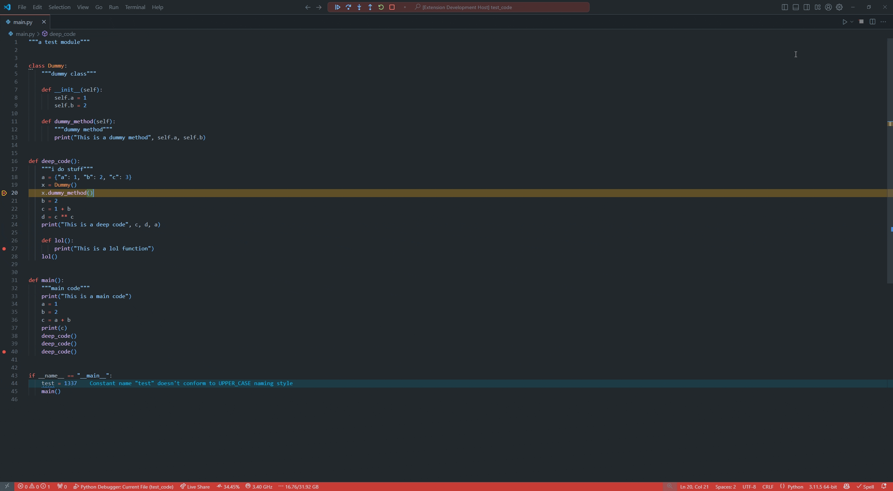

# Debug graph

A Visual Studio Code extension that shows all the function calls (code paths) that lead to a breakpoint.

## Features

## Requirements

This extension works with **all languages** that Visual Studio Code supports.
Although, i have only tested:

* Go
* Python
* JavaScript
* TypeScript

<!-- more testing needed 
* c#
* c++
* c
* Java (limited)
-->

## How to get started

1. Set a breakpoint in your code
2. Click on the `Call Graph` icon in the top bar of your editor
3. See what variables are and where you are coming from

## How to install

1. Open Visual Studio Code
2. Go to the Extensions view by clicking on the square icon in the sidebar
3. Search for `Call Graph`
4. Click on the Install button

## Known Issues

* Sometimes the theme colors are not matched to vscode theme, this resolves when opening the call graph again
