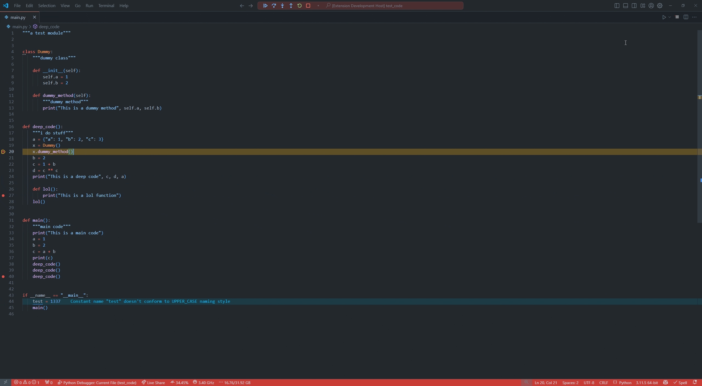

# 📊 Debug Graph

A Visual Studio Code extension that visualizes the function calls (code paths) leading up to your breakpoints. Gain insights into the execution flow in your code and troubleshoot efficiently!

## ✨ Features

- **Visual call graph** — See the full chain of function calls that led to your breakpoint, rendered as an interactive tree
- **Multi-language support** — Works with Go, Python, JavaScript, TypeScript, C++, C, Rust, C#, Zig, and more
- **Variable inspection** — Hover over any stack frame to view variables and their values at that point in execution
- **Source-code navigation** — Click any frame in the graph to jump directly to the corresponding line in the editor
- **MCP-powered AI debugging** — Exposes all debug capabilities as MCP tools so AI agents can help you inspect and step through code (see [MCP Server](#-mcp-server--debugging-skills-for-ai-agents) section)

## 🚀 Requirements

This extension is designed to work with **all languages** supported by Visual Studio Code. However, the following languages have been tested for compatibility:

| Language | Debugger | Linux | Windows | Notes |
| --- | --- | --- | --- | --- |
| Go | golang | ✅ | ✅ | |
| Python | [debugpy](https://marketplace.visualstudio.com/items?itemName=ms-python.debugpy) | ✅ | ✅ | |
| JavaScript | Node | ❔ | ✅ | using node.js runtime |
| TypeScript | pwa-node | ✅ | ✅ | using Deno runtime |
| C++ | GDB | ✅ | ❔ | |
| C | GDB | ✅ | ❔ | |
| Rust | lldb | ✅ | ❔ | |
| C# | dotnet | ✅ | ✅ | dotnet 8 + 6 |
| Zig | lldb | ✅ | ❔ | version 0.14 |

✅ tested | ❌ not working | ❔ not tested

All test projects can be found in the [test_code](./test_code) directory.

> More testing is planned for additional languages such as C#, C, and Java.

## 🛠️ How to Get Started

1. Set a breakpoint in your code.
2. Click on the `Call Graph` icon in the top bar of your editor (only visible while debugging).
3. Explore the variables and trace the origin of your execution.

## 📥 How to Install

1. Open Visual Studio Code.
2. Go to the Extensions view (square icon in the sidebar).
3. Search for Debug Graph and click Install.

You can also install it directly from the [Visual Studio Marketplace](https://marketplace.visualstudio.com/items?itemName=k0in.debug-graph).

## 💻 Issues and Contributions

For bug reports or feature requests, please visit our [GitHub Repository](https://github.com/K0IN/stacktrace-history).

## 📦 Store Information

- Extension Name: **debug-graph**
- Extension ID: **k0in.debug-graph**
- [View on Visual Studio Marketplace](https://marketplace.visualstudio.com/items?itemName=k0in.debug-graph)

## Tech Stack

- TypeScript
- [Vue.js](https://vuejs.org/) (for the frontend)
- [Comlink](https://github.com/GoogleChromeLabs/comlink) (for communication between the frontend and backend)

## 🤖 MCP Server — Debugging Skills for AI Agents

Debug Graph ships with a built-in **MCP (Model Context Protocol) server** that gives AI coding agents (like GitHub Copilot) hands-on debugging capabilities. It effectively **adds debugging to the list of skills your agent can do**.

The MCP server exposes **12 tools** that let an agent interact with the VS Code debugger directly:

| Category | Tools |
|---|---|
| **Breakpoints** | `set_breakpoint`, `list_breakpoints` |
| **Session Control** | `start_debug`, `get_active_session` |
| **Inspection** | `get_stack_trace`, `get_variables`, `evaluate` |
| **Stepping** | `step_over`, `step_into`, `step_out` |
| **Execution** | `resume`, `pause` |

An agent can set breakpoints, launch debug sessions, inspect stack frames and variables, evaluate expressions, and control execution — all through natural language.

### 🧠 Built-in MCP Prompt for Agents

The MCP server publishes a **`debug_session_workflow` prompt** that any agent harness can invoke via the [MCP Prompt](https://modelcontextprotocol.io/docs/concepts/prompts) mechanism. Calling this prompt returns step-by-step instructions for the correct debug workflow.

With that prompt template, just ask your agent, what to debug, or to lookup the real value instead of static analysis. The agent will then use the MCP tools to inspect the execution and provide you with the answer.
